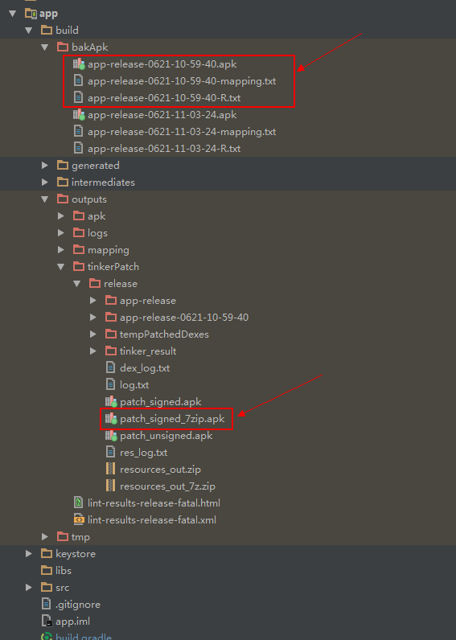

# 腾讯Tinker 接入的一些问题

  > 记录一下我集成使用的过程，集成过程中有遇到一些问题，希望大家能绕过这些坑，首先我是按github上面的官方demo和文档进行集成，然后自己又重新创建了项目进行练习,后面我会给出自己的github项目地址

  1. [ github上tinker地址](https://github.com/Tencent/tinker)

  2. [tinker接入指南地址](https://github.com/Tencent/tinker/wiki/Tinker-%E6%8E%A5%E5%85%A5%E6%8C%87%E5%8D%97)

##  导入官方Demo[tinker-sample-android](https://github.com/Tencent/tinker/tree/master/tinker-sample-android)

### 集成

我这里直接使用的是他1.7.11版本,导入项目里面自带的tinker-sample-android到studio中。

### 初始化配置

  首先我们需要在app/bulid.gradle中，设置tinkerId的值，很多人开始编译就报错，提示“tinkerId is not set!!!”，就是因为这个值没有设置。获取tinkerId走的

        def gitSha() {  
        return 'git rev-parse --short HEAD'.execute().text.trim()  
        }  

这个方法，也就是获取git最近一次commit的版本号，所以要是你的当前Project没有配置git，或者当前的Project还没有commit过，或者git没有加入到环境变量中，会获取不到该值。知道了原理，那解决方式就自己想了，我这里就直接写死，上面这个方法直接返回固定字符串。

---

之后，我们会看到Manifest.xml中，SampleApplication.Java这个类报红找不到。这个并不影响，因为到时候我们在编译的时候，tinker会为我们生成SampleApplication.java这个类，直接rebuild就好。

### 按官方的文档操做了一遍，使用步骤详解

Demo请参考[tinker-sample-android](https://github.com/Tencent/tinker/tree/master/tinker-sample-android), 它的使用方法如下：

1.调用`assembleDebug`编译，我们会将编译过的包保存在build/bakApk中。然后我们将它安装到手机，点击`SHOW INFO`按钮，可以看到补丁并没有加载。


2.修改代码，例如将[MainActivity](https://github.com/Tencent/tinker/blob/master/tinker-sample-android/app/src/main/java/tinker/sample/android/app/MainActivity.java)中`I am on patch onCreate`的Log打开。然后我们需要修改[build.gradle](https://github.com/Tencent/tinker/blob/master/tinker-sample-android/build.gradle)中的参数，将步骤一编译保存的安装包路径拷贝到`tinkerPatch`中的`oldApk`参数中。
	

3.调用`tinkerPatchDebug`, 补丁包与相关日志会保存在`/build/outputs/tinkerPatch/`。然后我们将`patch_signed_7zip.apk`推送到手机的sdcard中。

```java
 adb push ./app/build/outputs/tinkerPatch/debug/patch_signed_7zip.apk /storage/sdcard0/
```

4.点击`LOAD PATCH`按钮, 如果看到`patch success, please restart process`的toast，即可锁屏或者点击`KILL SELF`按钮 
	

5.我们可以看到的确出现了`I am on patch onCreate`日志，同时点击`SHOW INFO`按钮，显示补丁包的确已经加载成功了。 
	

##  自己练习Demo，编译Release版本[tinker-my-test](https://github.com/dingjinwen/tinker-my-test.git)  
> debug版本的编译，和release版本的基本类似，在编译debug版本的时候我没有加signingConfigs里面keystore，buildTypes里面debug这些的配置，就可以编译apk和R文件了，但是编译release版本的时候，不能生成apk文件，所以有了第3步的那些配置，新建了一个keystore包，把debug.keystore和release.keystore放在下面

1.在项目的 `build.gradle ` 中，添加 `tinker-patch-gradle-plugin `的依赖

```gradle
	buildscript {
	    dependencies {
	        classpath ('com.tencent.tinker:tinker-patch-gradle-plugin:1.7.11')
	    }
	}
```


2.在app的 `build.gradle `中，添加如下配置

```gradle
dependencies {
	//可选，用于生成application类 
	provided('com.tencent.tinker:tinker-android-anno:1.7.11')
	//tinker的核心库
	compile('com.tencent.tinker:tinker-android-lib:1.7.11') 
}
	...
	...
	//apply tinker插件
	apply plugin: 'com.tencent.tinker.patch'
```

3.在app的 `build.gradle `中，添加编译release版本的配置

```gradle
android {
    signingConfigs {
        release {
            try {
                storeFile file("./keystore/release.keystore")
                storePassword "testres"
                keyAlias "testres"
                keyPassword "testres"
            } catch (ex) {
                throw new InvalidUserDataException(ex.toString())
            }
        }
        debug {
            storeFile file("./keystore/debug.keystore")
        }
    }

    buildTypes {
        release {
            minifyEnabled true //控制是否混淆的，生不生成mapping文件
            signingConfig signingConfigs.release //这句话影响能不能生成apk文件，之前没写这句，在bakApk下不能生成apk文件
            proguardFiles getDefaultProguardFile('proguard-android.txt'), 'proguard-rules.pro'
        }
        debug {
            debuggable true
            minifyEnabled false
            signingConfig signingConfigs.debug
        }
    }
}
```


4.先创建一个 `SampleApplicationLike `继承至  `DefaultApplicationLike `.
         

5.先执行 `assembleRelease `生成一个基准文件包bakApk，包括apk文件，R文件，mapping文件（mapping文件 `minifyEnabled  true  `开启了混淆的有， `minifyEnabled  false  `没有开启的没该文件）
         

6.修改代码，在 `MainActivity `的 `onCreate()`方法里面加了一个 `Toast `， `activity_main `里面把`TextView`的文字改了一下
         
         

7.修改app下 `build.gradle `中的参数，将步骤3编译保存的安装包路径拷贝到`tinkerPatch`中的`tinkerOldApkPath`参数中。
         

8.调用`tinkerPatchRelease`, 补丁包与相关日志会保存在`/build/outputs/tinkerPatch/`。然后我们将`patch_signed_7zip.apk`推送到手机的sdcard中。

```java
   adb push ./app/build/outputs/tinkerPatch/debug/patch_signed_7zip.apk /storage/sdcard0/
```

9.点击`Load Patch`按钮, 加载补丁文件，加载完成App会自动关闭，再重新App就可以效果了。

